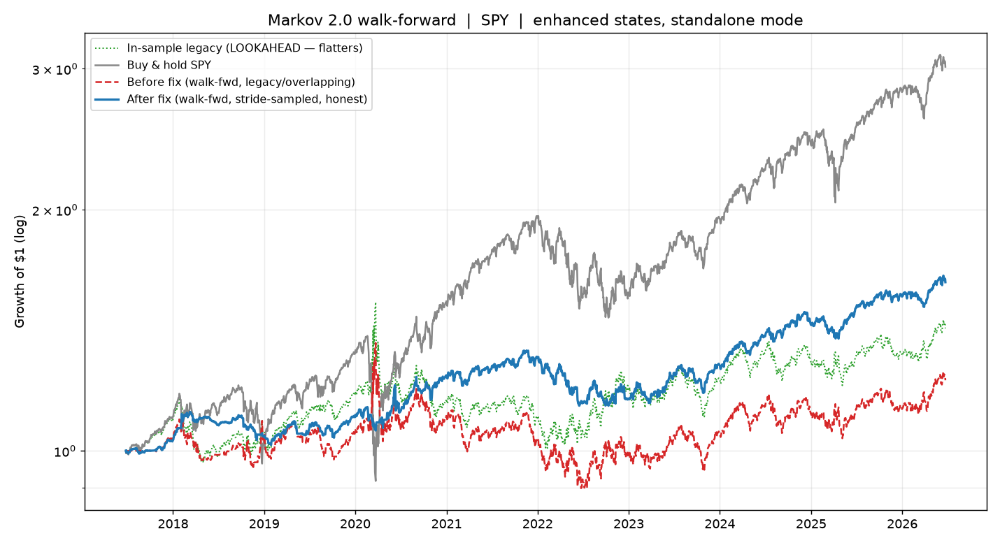

# Markov 2.0 — SPY demo (proof, not promises)

Reproduce:

```bash
python ../scripts/markov2.py --csv spy.csv --states enhanced --mode standalone \
    --hmm --backtest --plot spy_equity.png --json spy_summary.json
```

**Data:** SPY daily OHLCV, 2015-06-24 → 2026-06-23 (2,765 split-adjusted bars),
pulled via the Robinhood MCP `get_equity_historicals` (no API key). Config:
**enhanced states (6 clusters), STANDALONE mode**, 20-day window, ±5% thresholds.

## FIX 1 — stickiness is mostly an autocorrelation artifact

The legacy (overlapping-window) matrix wildly overstates persistence because
consecutive 20-day windows share 19 days:

| state (enhanced) | legacy diag | stride diag | legacy overstates by |
|---|---|---|---|
| C0 (bear)  | 0.828 | 0.238 | +0.590 |
| C2 (bear)  | 0.406 | 0.111 | +0.294 |
| C4 (bear)  | 0.950 | 0.000 | +0.950 |
| C5 (bull)  | 0.767 | 0.316 | +0.451 |

Only the stride-sampled matrix is statistically honest.

## FIX 2 — label mapping self-verified

| period | dominant label | expected | result |
|---|---|---|---|
| COVID crash 2020 (Feb 24–Mar 23) | BEAR (76%) | BEAR | PASS |
| Apr 2020 V-rebound (Apr 6–Jun 8) | BULL (68%) | BULL | PASS |
| Summer 2017 calm (Jun–Sep) | SIDEWAYS (100%) | SIDEWAYS | PASS |

Mapping **VERIFIED** (0=sideways, 1=bull, 2=bear) — no bull/bear swap.

## HMM cross-check (unsupervised, 2-state, daily returns)

The HMM never saw the ±5% thresholds. On the days the threshold makes a
directional call, the HMM **independently agrees on direction 80.8%** of the time
(100% coverage) → **green light**: the regimes are real, not an artifact of where
the lines were drawn.

## Walk-forward backtest (2017-06-26 → 2026-06-23, 2,260 days)

The matrix deciding day *t+1* is built only from data up to day *t*.

| run | total | CAGR | win | PF | max DD | Sharpe |
|---|---|---|---|---|---|---|
| IN-SAMPLE legacy (LOOKAHEAD — do not trust) | 42.20% | 4.00% | 53.4% | 1.07 | −34.3% | 0.33 |
| Before fix — walk-fwd legacy | 22.51% | 2.29% | 53.1% | 1.05 | −34.2% | 0.23 |
| **After fix — walk-fwd stride** | **62.41%** | **5.56%** | **54.8%** | **1.14** | **−14.7%** | **0.68** |
| Buy & hold SPY | 201.72% | 13.10% | 55.7% | 1.16 | −34.1% | 0.75 |



### How to read this honestly

- **Flattering is real:** the *same* legacy matrix scores 42% with lookahead vs
  22% walk-forward — in-sample fitting roughly doubled the return out of thin air.
- **The fix helps where it counts:** the honest stride matrix nearly halves max
  drawdown (−34% → −15%) and triples Sharpe (0.23 → 0.68) vs the legacy
  walk-forward, because it stops trusting fake persistence and exits stale trades.
- **It still lags buy & hold.** A regime-timing standalone strategy on a secular
  bull like SPY will usually trail simple buy-and-hold — it sits out drift to cut
  drawdown. That is the honest tradeoff, shown not hidden.

> Backtests flatter. The fixed matrix shows uglier, truer numbers — those are the
> only ones worth trading.

*Not financial advice. Probabilistic regime signals fit to past data can fail.*
